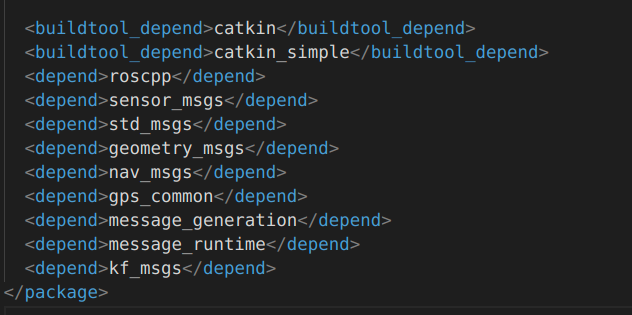

# catkin_simple 使用指南

# step 0 下载代码
```
cd ~/catkin_ws/src
git clone git@gitee.com:xjtu_vcciv/catkin_compile_tool.git
```
# step 1 package.xml依赖
在package.xml里面依赖catkin_simple
```
<buildtool_depend>catkin_simple</buildtool_depend>
```
如下图所示:


catkin_simple只是简化CMakeLists的写法,可以简化ros相关功能包的依赖写法
```
原本需要在xml里面填写
<depend>roscpp</depend>
<depend>std_msgs</depend>
同时需要在CMakeLists加上find_package
find_package(catkin REQUIRED COMPONENTS
  roscpp
  std_msgs
)
---
改为只需在.xml中填写
<depend>roscpp</depend>
<depend>std_msgs</depend>
是不是省事多了...
```
# step 2 CMakeLists指南之依赖
增加对catkin_simple的依赖
```
find_package(catkin_simple REQUIRED)
catkin_simple(ALL_DEPS_REQUIRED)
```
然后添加自己的依赖包,比如eigen和pcl
```
# find Eigen3
find_package(PkgConfig)
pkg_check_modules(EIGEN3 REQUIRED eigen3)
include_directories(${EIGEN3_INCLUDE_DIRS})

# find pcl
find_package(PCL 1.8 REQUIRED)
include_directories(${PCL_INCLUDE_DIRS})
link_directories(${PCL_LIBRARY_DIRS})
add_definitions(${PCL_DEFINITIONS})
```

# step 3 CMakeLists指南之生成项目库文件
如果按照directory_structure.md的说明进行了调整,直接添加下面代码即可
```
include_directories(inc)
file(GLOB_RECURSE ${PROJECT_NAME}_src src/*.cc)
cs_add_library(${PROJECT_NAME} ${${PROJECT_NAME}_src})
target_link_libraries(${PROJECT_NAME} xxx xxxx xxxx  xxxxx xxxxx)
```
# step 4 CMakeLists指南之生成ros节点
话不多说,上代码
```
cs_add_executable(xxxxxx_node node/xxxxxx_node.cc)
target_link_libraries(xxxxxx_node xxx xxxx xxxx  xxxxx xxxxx)
```
# step 5 CMakeLists指南之gtest
```
file(GLOB_RECURSE Test_Proj test/*.cc)
foreach(_var ${Test_Proj})
	get_filename_component(TEST_NAME ${_var} NAME_WE)
	cs_add_executable(${TEST_NAME} ${_var})
  target_link_libraries(${TEST_NAME} ${PROJECT_NAME} gtest glog)
endforeach()
```

# step 6 CMakeLists指南之install
```
# 指定头文件目录
set(${PROJECT_NAME}_LOCAL_INCLUDE_DIR ${CMAKE_CURRENT_SOURCE_DIR}/inc)
cs_install()

# cs_export 等同 catkin_package
cs_export(INCLUDE_DIRS inc
          LIBRARIES 
          CATKIN_DEPENDS 
          roscpp
          sensor_msgs
          std_msgs
          geometry_msgs
          gps_common
          DEPENDS 
          CFG_EXTRAS)
```
